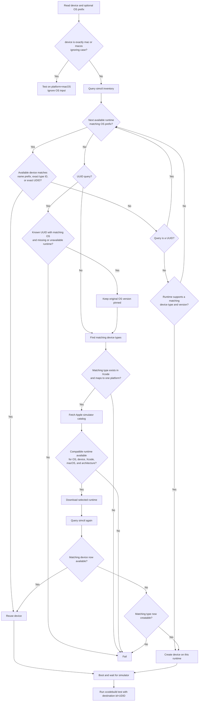

```mermaid
flowchart TD
    A["Read device and optional OS prefix"] --> B{"device is exactly mac or macos<br/>ignoring case?"}
    B -- Yes --> M["Test on platform=macOS<br/>Ignore OS input"]
    B -- No --> I["Query simctl inventory"]
    I --> R{"Next available runtime<br/>matching OS prefix?"}
    R -- Yes --> D{"Available device matches<br/>name prefix, exact type ID,<br/>or exact UDID?"}
    D -- Yes --> U["Reuse device"]
    D -- No --> Q{"Query is a UUID?"}
    Q -- Yes --> R
    Q -- No --> T{"Runtime supports a matching<br/>device type and version?"}
    T -- Yes --> C["Create device on this runtime"]
    T -- No --> R
    R -- No --> P{"UUID query?"}
    P -- Yes --> V{"Known UUID with matching OS<br/>and missing or unavailable runtime?"}
    V -- No --> E["Fail"]
    V -- Yes --> K["Keep original OS version pinned"]
    P -- No --> K2["Find matching device types"]
    K --> K2
    K2 --> F{"Matching type exists in Xcode<br/>and maps to one platform?"}
    F -- No --> E
    F -- Yes --> G["Fetch Apple simulator catalog"]
    G --> H{"Compatible runtime available<br/>for OS, device, Xcode,<br/>macOS, and architecture?"}
    H -- No --> E
    H -- Yes --> DL["Download selected runtime"]
    DL --> RI["Query simctl again"]
    RI --> X{"Matching device now available?"}
    X -- Yes --> U
    X -- No --> Y{"Matching type now creatable?"}
    Y -- Yes --> C
    Y -- No --> E
    U --> BOOT["Boot and wait for simulator"]
    C --> BOOT
    BOOT --> TEST["Run xcodebuild test with destination id=UDID"]
```
